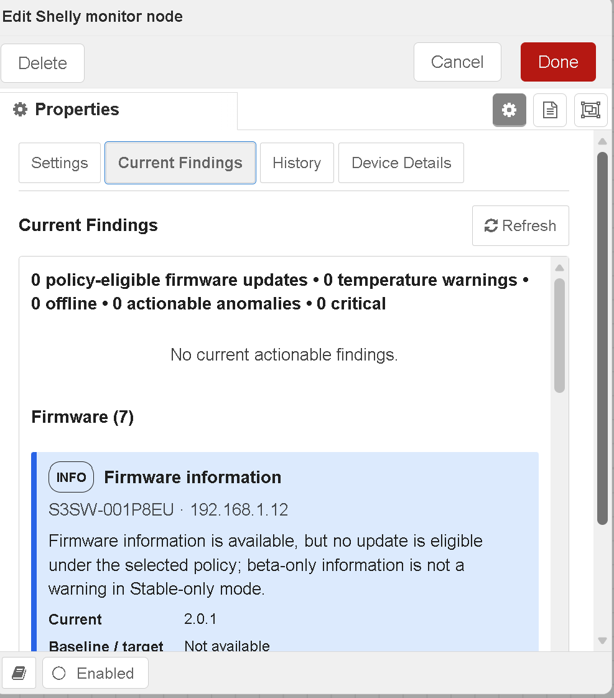

# @impact0815/node-red-contrib-shelly-admin

[English](README.md) · **Deutsch**

Node-RED-Nodes zur lokalen Shelly-Flottenverwaltung: Discovery, persistentes Inventar, Firmware-Richtlinien, abgesicherte Wartung, historische Überwachung, geräteeigene Baselines, vorsichtiger Peer-Vergleich und explizite Observation-Lebenszyklen. Shelly Gen1 bis Gen4 werden über die Gen1- und Gen2+-HTTP-APIs unterstützt. MQTT ist optional und keine Paketabhängigkeit.

## Sicherheit und Geltungsbereich

> **⚠️ Nutzung auf eigene Gefahr – keine Gewährleistung.** Dies ist ein inoffizielles Community-Projekt ohne Verbindung zu oder Unterstützung durch Shelly beziehungsweise Allterco. Die Software wird „wie besehen“ bereitgestellt.
>
> Trends und Anomalien sind **keine garantierte Ausfallvorhersage**. Sie ersetzen weder Herstellerschutzfunktionen, Rauchmelder, fachgerechte Elektroinstallation und Prüfung noch Brandvorsorge und beaufsichtigte Wartung.
>
> Eine automatische Temperaturabschaltung bleibt deaktiviert, solange nicht sowohl der Monitor-Modus **Explizite Richtlinienaktionen** als auch eine exakte Gerätefreigabe gesetzt sind. Ein Ausgang wird niemals automatisch wiedereingeschaltet.

## Nodes und Kompatibilität

| Node-Typ | Aufgabe | Bestehende Ausgänge bleiben erhalten |
|---|---|---|
| `shelly-admin-config` | Gemeinsame Zugangsdaten, Erkennung, Persistenz, Historie, Analyse und Sicherheit | Konfigurationsnode |
| `shelly-admin-discovery` | Vollständige/inkrementelle Erkennung und Inventarvalidierung | Inventar · Ereignisse · Fehler |
| `shelly-admin-monitor` | Abfrage, Historie, Observations und Temperatursicherheit | Gesundheit · Hinweise · Fehler |
| `shelly-admin-maintenance` | Firmwareprüfung, Dry-run, rollierende Updates und konditionelle Neustarts | Ergebnis · Gerätefortschritt · Fehler |

Version 0.3.0 erhält Node-Typen, dreifache Ausgangsverdrahtung, Node.js 18+/Node-RED 3.1+, Gen1–Gen4-Normalisierung, Context-Store-Persistenz, Stable als Firmwarestandard, explizite Beta-Freigabe, strukturierte Fehler und die Temperatursicherheitslogik. Neu ist die duale Bedienung: Jeder operative Befehl steht per `msg.action` und über Start-/Abbrechen-Schaltflächen im Editor-Dialog der deployten Node zur Verfügung.

## Einheitliche Action- und Lifecycle-API

| Node | Start-/Laufaktionen | Steueraktionen |
|---|---|---|
| Discovery | `start`, `scan`, `full`, `incremental` | `cancel`, `status` |
| Monitor | `start`, `poll`, `check` | `cancel`, `status`, `enable`, `disable` |
| Maintenance | `start`, `check`, `update`, `reboot` | `cancel`, `status` |

Beispiel:

```json
{"action":"scan","mode":"full","targets":"192.168.10.0/24"}
```

Jeder aktive Lauf besitzt eine `runId`. Fortschritt und Abschluss melden `state`, `phase`, `processed`, `total`, `unprocessed`, Zeitstempel und ein eingebettetes `shelly-admin.lifecycle/1`-Objekt. Einheitliche Zustände: `started`, `running`, `cancel-requested`, `cancelled`, `completed`, `completed-with-issues`, `failed`. `status` arbeitet rein lesend. `cancel` ist idempotent und meldet `idle`, wenn nichts läuft.

Der Abbruch wird durch Parallelisierung, HTTP-Requests, Firmwareprüfungen, Validierungsabfragen nach Neustarts und Staffelwartezeiten propagiert. Abgeschlossene Gerätearbeit bleibt erhalten und wird persistiert. Nicht gestartete Discovery-Ziele werden nicht als offline gewertet; ein abgebrochener Vollscan setzt keinen neuen Abschlusszeitpunkt. Bereits vom Gerät angenommene Firmwareupdates oder Neustarts lassen sich nicht zurückrollen; das Ergebnis enthält Gerät und Abbruchpunkt.

Der vollständige Message-Vertrag je Node, Lifecycle-Datensätze, Output-Topics, Recovery-Beispiele, Firmwareabläufe und Abbruchsemantik stehen in [docs/MESSAGE-API.de.md](docs/MESSAGE-API.de.md) ([English](docs/MESSAGE-API.md)).

## Installation

Im Node-RED-Benutzerverzeichnis:

```bash
cd ~/.node-red
npm install @impact0815/node-red-contrib-shelly-admin@0.3.0
```

Aus dem bereitgestellten Paket:

```bash
cd ~/.node-red
npm install /pfad/zu/impact0815-node-red-contrib-shelly-admin-0.3.0.tgz
```

Anschließend Node-RED neu starten und eine `shelly-admin-config`-Node sowie die benötigten Discovery-, Monitor- und Maintenance-Nodes hinzufügen.

## Discovery und Firmware-Richtlinie

Ziele akzeptieren CIDR-Netze, vollständige oder verkürzte IPv4-Bereiche, Einzeladressen sowie Komma-/Zeilenlisten. Automatisch ermittelte Netze werden durch die kleinste Präfixlänge (Standard `/24`) und das Gesamtlimit (Standard `4096`) begrenzt. Nur autorisierte Netze scannen.

- Gen1: `/shelly`, `/settings`, `/status`
- Gen2–Gen4: `/shelly`, `Shelly.GetDeviceInfo`, `Shelly.GetStatus`
- Nur Stable ist die Standard-Firmware-Richtlinie; Beta muss ausdrücklich erlaubt werden.
- `firmwareCheckTimeoutMs` hat den Standard `2500`, akzeptiert `250–60000` und wird unverändert an die vollständige Prüfung und die Requests übergeben.
- Fehler oder Timeout eines Geräts stoppen die verbleibenden lesenden Firmwareprüfungen nicht.
- Ein Updatelauf arbeitet zweiphasig: zuerst werden alle ausgewählten Geräte geprüft; Update, Neustartwartezeit und Validierung laufen danach nur für policy-berechtigte Geräte. Unter Stable-only enden Beta-only- und Geräte ohne Update sofort als `skipped` mit `no-policy-eligible-update`.
- Fortschritt trennt `checked`, `eligible`, `skipped`, `updated`, `failed` und `timeouts`. Nach der Planung bezieht sich `processed/total` nur auf echte Updatekandidaten. Ein Dry-run liefert `plannedUpdates` und führt weder Update noch Staffel-, Neustart- oder Validierungswartezeit aus.

## Lokale Persistenz und Migration

Der Zustand wird ausschließlich über die unterstützte Node-RED-API `node.context().get/set` gespeichert. Für Neustartbeständigkeit einen `localfilesystem`-Store konfigurieren:

```js
contextStorage: {
  default: "memoryOnly",
  memoryOnly: { module: "memory" },
  file: { module: "localfilesystem", config: { flushInterval: 30 } }
}
```

Version 0.2.0 schreibt das explizite State-Schema `2` unter `shellyAdminStateV2`. Beim ersten Start kann der Zustand der 0.1.x-Versionen aus dem Schema-1-Schlüssel geladen werden. Unabhängig migriert werden:

- Inventar und aktive/behobene Fehler;
- Rohhistorie und Stundenaggregate;
- Temperatur- und Anomaliezustände;
- die Context-Store-Auswahl als reguläre Eigenschaft der Node-RED-Konfigurationsnode.

Ein beschädigter optionaler Teilbereich wird isoliert und verständlich gemeldet; ein gültiges Inventar bleibt geladen. Nur wegen fehlerhafter Historie oder Analyse erfolgt keine vollständige Neu-Inventarisierung. Der Datei-Context-Store kann Schreibvorgänge bis zum `flushInterval` puffern; Backups entsprechend planen.

Alte Config-Nodes müssen nicht neu angelegt werden. Fehlende oder leere Zahlenfelder werden beim Öffnen sichtbar mit dokumentierten Werten vorbelegt und beim Speichern konkret persistiert. Insbesondere wird `firmwareCheckTimeoutMs: ""` zu `2500` und nicht auf den Minimalwert geklemmt.

## Historische Überwachung 2.0

Die Historie speichert nur tatsächlich gemeldete Messwerte. Erreichbarkeit wird ausdrücklich erfasst; fehlende Temperatur-, RSSI-, Ressourcen- oder elektrische Werte werden nicht in Nullwerte umgewandelt.

Verfügbare Messgrößen:

- Erreichbarkeit und HTTP-Latenz;
- Temperatur, RSSI und Uptime;
- freie RAM- und Dateisystem-Prozentwerte;
- Wirkleistung, Strom, Spannung und kumulierte Energie;
- Firmwareversion und Konfigurationsrevision als Änderungsdimensionen.

Standardwerte:

| Einstellung | Standard |
|---|---:|
| Rohdatenaufbewahrung | 48 Stunden |
| Aggregataufbewahrung | 90 Tage |
| Bucket-Breite | 60 Minuten |
| Rohwerte/Gerät | 10.000 |
| Aggregate/Gerät | 10.000 |
| Ungefähre Historienbytes/Gerät | 1.048.576 |

Rohdaten und Zeit-Buckets bestehen nebeneinander. Buckets enthalten Anzahl, Mittelwert, Minimum, Maximum, letzten Wert, Coverage und Missing-Ratio. Beim Speichern erzwingt die Kompaktierung Alters-, Mengen- und Größenlimits pro Gerät. Metadaten enthalten Sample-Anzahl, ersten/letzten Messpunkt, geschätzten Takt, Missing-Ratio, Warm-up, Neustarthistorie sowie Firmware-/Konfigurationssegmente. Aggregate erhalten Baselines über Node-RED-Neustarts und über das Ende der Rohdatenaufbewahrung hinaus.

## Geräteeigene Baselines und Profile

Primär ist immer die eigene Gerätebaseline. Sie verwendet Median, Median Absolute Deviation (MAD) sowie p05/p25/p50/p75/p95 statt einer undurchsichtigen Gesamtnote.

| Profil | Mindestwerte | Warm-up | Auslösung | Entwarnung | Cooldown |
|---|---:|---:|---:|---:|---:|
| **Conservative** (Standard) | 24 | 12 | 3 | 3 | 120 min |
| Balanced | 16 | 8 | 3 | 2 | 60 min |
| Sensitive | 10 | 5 | 2 | 2 | 30 min |
| Custom | konkrete Feldwerte | konkret | konkret | konkret | konkret |

Firmware- oder relevante Konfigurationswechsel beginnen ein neues Baseline-Segment und Warm-up. Ein einzelner Peak öffnet keinen Trend. Mehrere normale Werte schließen ihn. Der Cooldown begrenzt aktualisierte Warnungen; `present` kann weiterhin den aktuellen Zustand beschreiben.

## Vorsichtiger Peer-Vergleich

Peers müssen Generation, Modell/Model-Code, Profil, Messfähigkeiten und standardmäßig die Firmware-Hauptversion teilen. Die Mindestgröße beträgt drei Geräte einschließlich des aktuellen. Peer-Vergleich ergänzt nur die Eigenbaseline. Eine ungeeignete oder zu kleine Gruppe erzeugt keine Peer-Warnung. Die Observation dokumentiert Gruppengröße, Minimum, Kriterien, Auswahlgründe und – bei Verwendung – Peer-IDs.

## Observation-Kategorien

In der Config-Node getrennt aktivierbar:

- Recovery-/Fehlerlebenszyklus;
- Latenztrend;
- Temperaturtrend;
- Neustartmuster;
- RAM-/Dateisystemtrend;
- konservative elektrische Beobachtungen;
- Peer-Vergleich.

Latenztrends benötigen dauerhafte Abweichungen zur Eigenbaseline. Verschlechtern sich genügend Geräte gleichzeitig, wird ein **möglicher gemeinsamer Netzwerkfaktor** markiert, ohne eine Ursache zu behaupten.

Temperaturtrends sind von statischer `warning`-, `critical`- und Hardware-Overtemperature-Klassifikation getrennt. Gleichzeitige Leistung wird, soweit vorhanden, als Kontext angegeben. Ein Temperaturtrend löst niemals allein eine Abschaltung aus.

Die Neustartanalyse führt Uptime-Abfälle und eine begrenzte Historie. Firmwareupdates und angeforderte Wartungsneustarts setzen Erwartungsmarker. Wiederholte unerwartete Neustarts werden getrennt gemeldet; Unsicherheiten durch Counter-Reset, fehlende Uptime oder API-Änderung bleiben sichtbar.

Die Ressourcenanalyse überspringt Geräte ohne Werte und verlangt dauerhafte RAM-/Dateisystemänderungen. Elektrische Beobachtungen arbeiten bewusst konservativ und aktivitätsbezogen. Null- und Nahe-null-Leistungsphasen gelten als reguläre Betriebszustände – einzeln, lang, zyklisch, täglich/nachts oder häufig zwischen Aus und Last wechselnd. Aktive Last wird nur mit einer ausreichend gefüllten Active-State-Baseline verglichen; der erste Wechsel von historisch 0 W zu Last reicht nicht aus. Elektrische Auslösungen verlangen mehr Wiederholungen als allgemeine Trends. Stark korrelierte Befunde für `powerW` und `energyRateWhPerHour` werden zusammengeführt. Zählerabfälle müssen weiterhin wiederholt auftreten; jeder verbleibende Befund nennt Nutzung, Reset, Datenlücke, Firmware oder Austausch als mögliche Erklärung und behauptet keinen Defekt.

## Observation Schema 2

Observations verwenden `shelly-admin.observation/2` und bleiben rückwärtsfreundliche JSON-Objekte. Lebenszyklen:

- `opened` – Zustand wurde aktiv;
- `present` – weiterhin aktiv, kein neuer Übergang;
- `updated` – nach Cooldown wesentlich verändert;
- `cleared` – genügend Normalwerte haben geschlossen;
- `suppressed` – Warm-up, Datenmenge, Coverage oder Richtlinie reichen nicht.

Jede Anomalie enthält Messwert, Eigenbaseline, optionalen Peer-Vergleich, Confidence, Datenqualität, Gründe und Disclaimer. Es gibt weder Gesamtnote noch garantierte Ausfallprognose.

Ein Offline-Vorfall speichert genau einen aktiven `lastError` mit Auftretens-/letztem Auftretenszeitpunkt und Anzahl. Wiederholte Fehlversuche erzeugen kein weiteres Open-Event. Die erste erfolgreiche Discovery-, Monitor-, Firmwareprüfungs-, Updatevalidierungs- oder Rebootvalidierungsanfrage schließt den Fehler genau einmal, persistiert `lastResolvedError` mit Auftretens-/Auflösungszeit und Grund und erhält das Gerät im Inventar.

## Monitor-Modi und Status

Der Monitor bietet:

- **Nur aktueller Zustand**;
- **Nur Übergänge**;
- **Aktueller Zustand und Übergänge** (Standard und kompatibles Verhalten für bestehende Flows).

Der normale Bearbeitungsdialog der Monitor-Node enthält jetzt vier sichtbare, per Tastatur fokussierbare Ansichten:

- **Einstellungen** – alle bisherigen Monitorparameter sowie Start-/Abbrechen-Schaltflächen;
- **Aktuelle Befunde** – die zuletzt bekannten Runtime-Befunde, gruppiert als Firmware, Temperatur, Offline/Recovery, Trends, Ressourcen und elektrische Beobachtungen;
- **Historie** – die letzten 50 menschenlesbaren Befundzustände und Übergänge, neueste zuerst, einschließlich `opened`, `updated`, `present`, `cleared` und Recovery, ohne den Rohzeitreihenbestand auszugeben;
- **Gerätedetails** – Inventarauswahl sowie Identität, Modell, Generation, IP, Erreichbarkeit, Firmware, Temperatur, Latenz, Ressourcen, aktive Befunde, aufgelöste Fehler und verfügbare Median-/MAD-Baselines.

Jede Ergebnisansicht lädt nur beim ersten Wechsel auf diesen Tab im aktuell geöffneten Dialog, nach erneutem Öffnen des Dialogs oder über die sichtbare Schaltfläche **Aktualisieren**. Es gibt kein periodisches Editor-Refresh; Tabwechsel setzen daher Leseposition und Auswahl nicht wiederholt zurück. Beim manuellen Aktualisieren bleiben Scrollposition und ausgewähltes Gerät nach Möglichkeit erhalten. Lade-, Fehler- und Leerzustände sind sichtbar. Jede Befundkarte zeigt Schweregrad, verständlichen Titel, Gerät/Modell, IP, Erklärung, aktuellen Wert, Baseline oder Firmware-Ziel, Lifecycle und Zeitpunkt. Kritisch, Warnung, Info und Behoben sind visuell getrennt. Fehlende Gerätemesswerte erscheinen als **Nicht verfügbar** und niemals als Nullwert.

Die Editoransicht verwendet folgende nur lesende Admin-Routen:

- `GET /shelly-admin/nodes/:id/findings`
- `GET /shelly-admin/nodes/:id/history?limit=50` (serverseitig auf 1–200 begrenzt)
- `GET /shelly-admin/nodes/:id/devices`

Alle drei Routen verlangen die Node-RED-Berechtigung `shelly-admin.read`, deaktivieren Response-Caching und liefern ausschließlich freigegebene Betriebsfelder – niemals Zugangsdaten. Historie und aktuelle Befunde werden zusammen mit dem vorhandenen Context-Zustand persistiert; die menschenlesbare Historie bleibt auf 200 Einträge begrenzt.

Der Bearbeitungsdialog der Wartungs-Node bietet entsprechend die Ansichten **Einstellungen**, **Aktueller Status**, **Geräteübersicht** und **Historie**. Die Geräteübersicht zeigt Gerätename/Modell, Geräte-ID, IP, Generation, Erreichbarkeit, aktuelle Firmware, Stable-/Beta-Verfügbarkeit gemäß Richtlinie, Updateberechtigung, Status/Zeitpunkt des letzten Firmwarechecks, Zeitpunkt/Ergebnis des letzten Updates, letztes erfolgreiches Update, letzten fehlgeschlagenen Versuch, Fehler/Zeitüberschreitungen, Recovery nach Update sowie aktive/abgeschlossene Läufe. Filter sind **Update verfügbar**, **Fehler**, **Offline**, **Erfolgreich aktualisiert** und **Übersprungen**. Fehlende Werte erscheinen als **Nicht verfügbar**. Dieselbe Regel für einmaliges Laden/manuelles Aktualisieren gilt; Filter, Geräteauswahl und Scrollposition bleiben nach Möglichkeit erhalten.

Wartung verwendet zusätzlich folgende nur lesenden, nicht cachebaren und durch `shelly-admin.read` geschützten Routen:

- `GET /shelly-admin/nodes/:id/maintenance/status`
- `GET /shelly-admin/nodes/:id/maintenance/devices`
- `GET /shelly-admin/nodes/:id/maintenance/history?limit=50` (serverseitig auf 1–200 begrenzt)

Abgeschlossene Wartungszusammenfassungen und ihre freigegebenen Geräteergebnisse werden additiv als begrenzte Historie (100 Läufe) persistiert. Zugangsdaten und beliebige private Geräte-Payloads werden nicht aufgenommen.

Die drei vorhandenen Ausgänge bleiben Gesundheit, Hinweise und Fehler. Bestehende Observation-Schema-2-Objekte bleiben unverändert. Health- und Hinweis-Payload ergänzen `summaryText`, `summaryTextDe`, `humanSummary`, `findingsSummary` und gruppierte `cards`. Die kanonischen Gruppen heißen `firmware`, `temperature`, `recovery`, `trends`, `resources` und `electrical`; das bisherige Aggregat `cards.anomalies` bleibt als Kompatibilitätsalias erhalten. Der Node-Status zählt policy-berechtigte Firmwareupdates, Temperaturwarnungen, Offline-Geräte, handlungsrelevante Anomalien und Critical-Zustände. Reine Beta-Informationen unter Stable-only bleiben Info und werden nicht als Warnung gezählt; reguläre Nullleistungsphasen und normale Lastwechsel werden nicht zu elektrischen Problemfällen.

## Temperatursicherheit

Standardwerte: 70 °C Warning, 85 °C Critical, 5 °C Hysterese, drei aufeinanderfolgende Werte und 15 Minuten Cooldown. Hardware-Overtemperature bleibt getrennt. Automatische Abschaltung erfordert gleichzeitig:

1. Monitor-Modus `actions` und
2. exakte `id`-, `ip`- oder `mac`-Richtlinie mit `temperature.autoShutdown: true`.

```json
[
  {
    "match": { "id": "shellyplus1pm-aabbccddeeff" },
    "policy": {
      "temperature": {
        "warningC": 70,
        "criticalC": 85,
        "hysteresisC": 5,
        "consecutive": 3,
        "cooldownMinutes": 15,
        "autoShutdown": false,
        "outputs": [0]
      }
    }
  }
]
```

Nur bekannte Schaltausgänge werden adressiert. Automatisches Wiedereinschalten findet nie statt.

## Menschengerechte Überwachungsoberfläche
 
Die Überwachungsnode enthält zusätzliche Editoransichten:
 
- Aktuelle Befunde
- Historie
- Gerätedetails
 
Dadurch können Firmwarehinweise, Warnungen, Recovery-Ereignisse und Trends direkt im Node-RED-Editor betrachtet werden, ohne die JSON-Ausgaben analysieren zu müssen.
 


## Vollständige importierbare Beispiele

Eine JSON-Datei aus `examples/` importieren; die Nodes müssen nicht manuell zusammengesetzt werden:

- `01-discovery-monitor.json` – kompakter Discovery-/Monitor-Einstieg;
- `02-safe-maintenance.json` – kompakter Wartungseinstieg;
- `03-complete-operations-en.json` – vollständiger englischer Flow für Bedienung, Abbruch, Dashboard, Benachrichtigungen, Debugging, Firmware, Recovery, Temperatur, Anomalien und Trends;
- `04-kompletter-betrieb-de.json` – funktional gleichwertiger deutscher Flow.

Die vollständigen Flows verwenden nur diese Shelly-Admin-Nodes und Node-RED-Core-Nodes. Das Browser-Dashboard liegt unter `/shelly-admin-dashboard-en` beziehungsweise `/shelly-admin-dashboard-de` und aktualisiert sich alle 15 Sekunden. Das Benachrichtigungsrouting schreibt Übergangswarnungen in Runtime-Log und Debug-Seitenleiste und kann leicht um freigegebene E-Mail-, Teams-, MQTT- oder Webhook-Nodes ergänzt werden. Ein echtes Firmwareupdate ist doppelt durch ein explizites Flow-Context-Flag und eine exakte Platzhalter-Geräte-ID gesperrt; lesende Prüfung und Dry-run funktionieren unmittelbar nach Prüfung der Ziel-/Config-Werte. Siehe [examples/README.de.md](examples/README.de.md).

## Entwicklung und Prüfung

```bash
npm ci
npm run lint
npm test
npm run test:coverage
npm pack --dry-run
```

Release-, npm-, Node-RED-, Docker-, Prüfsummen- und Git-Befehle stehen in [RELEASE.md](RELEASE.md). Änderungen stehen in [CHANGELOG.md](CHANGELOG.md) und [RELEASE-NOTES-0.3.0.md](RELEASE-NOTES-0.3.0.md).
